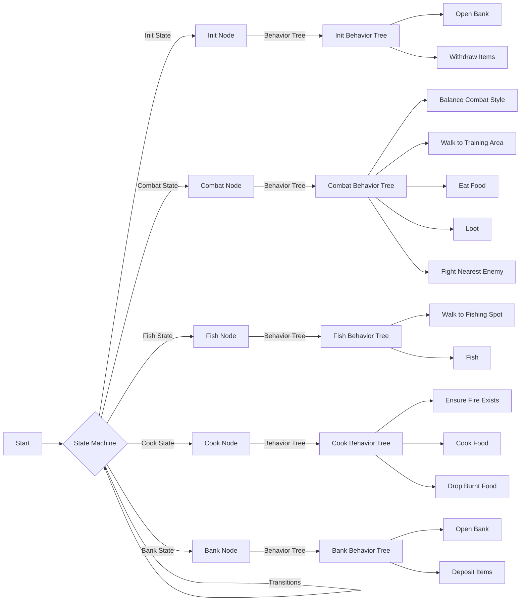

# VeloxCombat

VeloxCombat is an advanced combat training script for Old School RuneScape (OSRS) using the TRiBot client. It offers a versatile and customizable experience for players looking to train their combat skills efficiently.

## Features

1. **Combat Training**: Automatically fights monsters based on the player's combat level and preferences.

2. **Dynamic Area Selection**: Chooses the best training area based on the player's stats and equipment.

3. **Adaptive Combat Styles**: Balances combat styles to ensure even skill progression or focuses on a preferred style.

4. **Smart Eating**: Configurable eating thresholds and options to eat to full health.

5. **Loot Collection**: Customizable loot settings to pick up valuable items.

6. **Fishing and Cooking**: Ability to fish and cook food when supplies are low.

7. **Banking**: Automatically banks items when inventory is full.

8. **GUI**: User-friendly graphical interface for easy configuration.

9. **State Machine**: Utilizes a state machine for efficient script flow and decision making.

10. **Anti-ban Measures**: Implements anti-ban features to make the script's behavior more human-like.

## Script Logic Structure

### Combat

The script selects monsters to fight based on the player's combat level and the available training areas. It uses a combination of local and global walking methods to navigate to the chosen area.

### Eating

The script manages the player's health by eating food when necessary. The eating threshold and whether to eat to full health are configurable through the GUI.

### Looting

VeloxCombat can be configured to loot specific items. The loot settings are managed through the GUI.

### Fishing and Cooking

When food supplies are low, the script can fish and cook to replenish its stock.

### Banking

The script automatically banks items when the inventory is full.

## GUI

VeloxCombat features a user-friendly GUI for easy configuration of various settings. The GUI allows users to adjust eating settings, combat preferences, and loot options.
